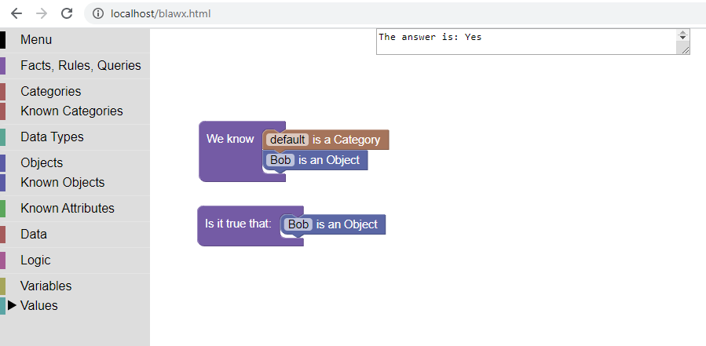

# Blawx
A user-friendly web-based tool for Rules as Code written by Jason Morris of [Lexpedite Legal Technologies Ltd.](https://lexpedite.ca).

Blocks + law = Blawx

## What is "Rules as Code"
Rules as Code is the idea that if you write rules in a programming langauge at the same time you write them in a natural language,
you end up with better rules, and you make it easier for people to automate implementations of those rules. The best programming
languages for encoding rules are declarative logic programming languages, but most of them are too hard to learn and use.

## What is Blawx?
Blawx is a friendly web-based tool for encoding and testing and using rules using declarative logic.

It has a front-end part and a back-end part. The front-end part is a web app based on 
[Google's Blockly](https://github.com/google/blockly) framework for visual
programming environments.

The back-end is an Apache server which hosts the front end, but also provides an API over which the front end and other applications
can send requests and get answers.

The server takes the request from the front end, converts it to [ErgoLite](http://flora.sourceforge.net/) code, and then 
sends that code to an ErgoLite reasoner
running on the webserver and returns
the results to the Blawx front end, or whichever other app made the request.

## How Can I Try It?
The easiest way to try Blawx is to go to www.blawx.com. The current version of Blawx is available for free at that site, and has all
the features of this package.

## How do I Install It Myself?
If you would like to try running Blawx locally, check out [INSTALL.md](INSTALL.md) for instructions on a manual installation,
or follow the instructions in [DOCKER.md](DOCKER.md) for instruction on how to install it as a docker container. Using the docker
container is the preferred method as it involves far fewer steps, and is likely to work on more operating systems.

## How Can I Learn More?
Documentation, including the Blawx Beginner's Guide, has been added to the repository and is available by selecting "Menu" and "Help" from your interface, or at [app.blawx.com/blawx.html](app.blawx.com/blawx.html).

## Is this software production ready?
No. Blawx is a proof of concept. It is appropriate for use in Rules as Code experiments, but not in production environments.
At least not yet.

## Contributions
Help is welcome. We need developers, testers, and people who can create documentation and learning materials.
